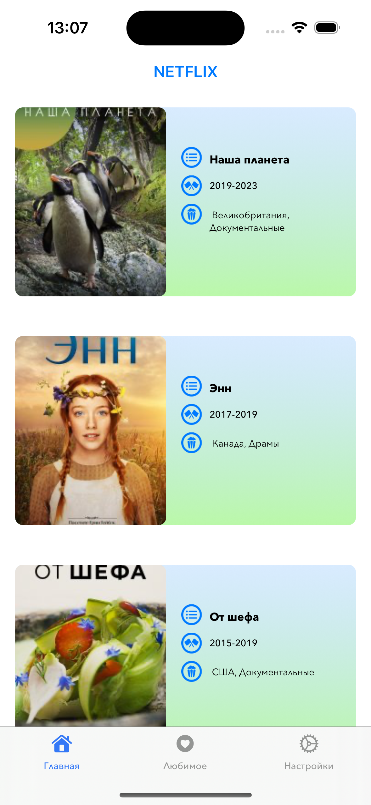
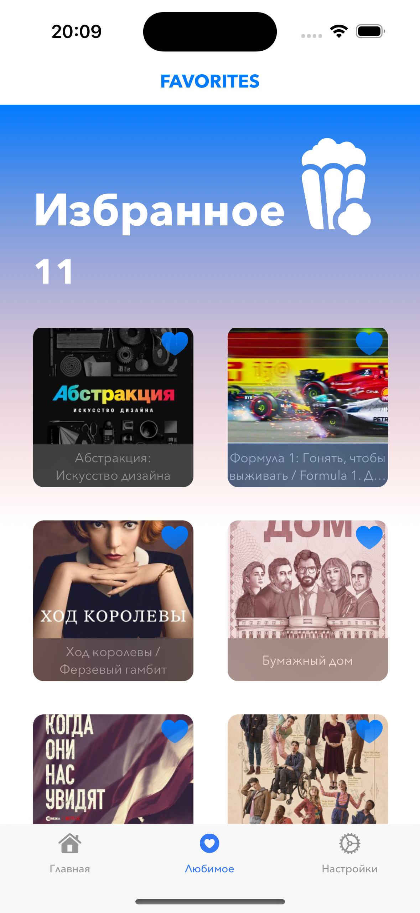

# Netflix App 
## 🎯 About app

 This application is the `UIKit` implementation of the iOS `Netflix app`. This app can be used to view and bookmark your favorite TV series, offering a convenient and user-friendly interface. The project will evolve with the different betas of `Xcode`. 
##    

  
  

## Architecture
The `Netflix` app fits currently the `MVP` pattern. 

  
  

## API
Netflix app uses dependencies such as `SnapKit`, `MessegeUI`, `SafariServices`

  <image src="Images/MoreDitailsAboutShow.gif" width="275"/>
  <image src="Images/aboutTheshowDark.png" width="275"/>

## Localization
The Netflix app supports [`Localization`](https://developer.apple.com/localization/) in two languages: `eng` and `rus`

  <image src="Images/SwitchTheme.gif" width="275"/>
  <image src="Images/ThemeDark.png" width="275"/>

